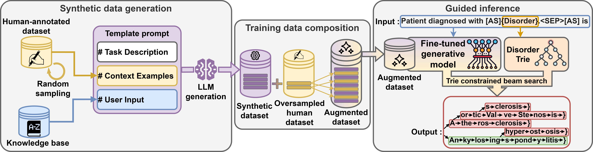

# SynCABEL: Synthetic Contextualized Augmentation for Biomedical Entity Linking

<div align="center">
    
    <p align="center">
<a href="https://github.com/astral-sh/uv" target="_blank">
    
</a>
<a href="https://github.com/astral-sh/ruff" target="_blank">
    
</a>
<a href="https://github.com/dmis-lab/ANGEL/blob/main/LICENSE">
   
</a>
</p>

<h3>
    <a href="https://huggingface.co/collections/AnonymousARR42/syncabel">🤗 SynCABEL HuggingFace Collection</a>
</h3>
</div>

## Introduction

**SynCABEL** is a novel framework designed to enhance generative biomedical entity linking (BEL) by leveraging Large Language Models (LLMs) to generate synthetic, contextualized training data for every concept in a target knowledge base (KB).

This repository contains a complete pipeline for:
- **Synthetic Data Generation**: Scripts and prompts to build custom synthetic datasets covering your entire KB.
- **Data Preprocessing**: Tools to convert BigBio datasets and select optimal concept synonyms using TF-IDF.
- **Fine-tuning**: Training scripts for decoder-only and seq2seq models.
- **Advanced Evaluation**: A novel **LLM-as-a-judge** protocol that assesses semantic relationships (equivalent, broader, narrower) between predictions and gold concepts, going beyond simple exact code matching.

## Direct Use

### Generated Synthetic Datasets

We constructed synthetic datasets for three corpora: MedMentions-ST21pv (English), QUAERO (French) and SPACCC (Spanish).

🤗 [AnonymousARR42/SynCABEL](https://huggingface.co/datasets/AnonymousARR42/SynCABEL)

| Dataset | Language | # Generated Examples | # Concepts in KB | KB Source |
| :--- | :---: | :---: | :---: | :--- |
| **SynthMM** | English | ~461k | ~153k | UMLS 2017AA |
| **SynthQUAERO** | French | ~397k | ~132k | UMLS 2014AB |
| **SynthSPACCC** | Spanish | ~1810k | ~362k | SNOMED CT 2021 |

### Human-Annotated Datasets

We evaluate SynCABEL using established **human-annotated biomedical entity linking benchmarks**, all obtained from publicly available sources and used under their original licenses.

* **MedMentions ST21pv (English)**
  UMLS-annotated corpus restricted to the ST21pv semantic types.
  🤗 HuggingFace: [`bigbio/medmentions`](https://huggingface.co/datasets/bigbio/medmentions)

* **QUAERO (French)**
  UMLS-annotated biomedical corpus derived from MEDLINE abstracts and EMEA documents.
  🤗 HuggingFace: [`bigbio/quaero`](https://huggingface.co/datasets/bigbio/quaero) (QUAERO-MEDLINE, QUAERO-EMEA)

* **SPACCC (Spanish)**
  SNOMED CT–based clinical entity linking corpus. The merged dataset is provided in this repository and was sourced from:
  - SympTEMIST ([https://zenodo.org/records/8223654](https://zenodo.org/records/8223654)),
  - DisTEMIST ([https://zenodo.org/records/7614764](https://zenodo.org/records/7614764)),
  - MedProcNER ([https://zenodo.org/records/8224056](https://zenodo.org/records/8224056))

### Fine-tuned Models

Checkpoints are available of our best performing model: **Llama-3-8B** fine-tuned on MM-ST21pv, QUAERO-EMEA, QUAERO-MEDLINE, SPACCC:

🤗 [AnonymousARR42/SynCABEL_MedMentions_st21pv](https://huggingface.co/AnonymousARR42/SynCABEL_MedMentions_st21pv) \
🤗 [AnonymousARR42/SynCABEL_SPACCC](https://huggingface.co/AnonymousARR42/SynCABEL_SPACCC) \
🤗 [AnonymousARR42/SynCABEL_QUAERO_EMEA](https://huggingface.co/AnonymousARR42/SynCABEL_QUAERO_EMEA) \
🤗 [AnonymousARR42/SynCABEL_QUAERO_MEDLINE](https://huggingface.co/AnonymousARR42/SynCABEL_QUAERO_MEDLINE)

#### Loading
```python
import torch
from transformers import AutoModelForCausalLM

# Load the model (requires trust_remote_code for custom architecture)
model = AutoModelForCausalLM.from_pretrained(
    "AnonymousARR42/SynCABEL_MedMentions_st21pv",
    trust_remote_code=True,
    device_map="auto"
)
```

### Inference
```python
# The input must follow this format
sentences = [
    "The patient was prescribed [Ibuprofen]{Chemicals & Drugs} to be taken every morning.",
    "[Myocardial infarction]{Disorders} requires immediate intervention."
]

results = model.sample(
    sentences=sentences,
    constrained=True, # With or without guided inference
    num_beams=3,
)

for i, beam_results in enumerate(results):
    print(f"Input: {sentences[i]}")

    mention = beam_results[0]["mention"]
    print(f"Mention: {mention}")

    for j, result in enumerate(beam_results):
        print(
            f"Beam {j+1}"
            f"Predicted concept name:{result['pred_concept_name']}"
            f"Predicted code: {result['pred_concept_code']} "
            f"Beam score: {result['beam_score']:.3f})"
        )
```

## Customize your own

### Requirements

1. **Install uv package manager**:
```bash
curl -LsSf https://astral.sh/uv/install.sh | sh
```
2. **Clone the repository**:
```bash
git clone https://github.com/AnonymousARR42/SynCABEL.git
cd SynCABEL
```
3. **Create virtual environment and install dependencies**:

```bash
uv venv --python 3.9
source .venv/bin/activate
uv sync
```

### Step-by-Step Pipeline

This framework is modular. You can start from raw data (Step 1) or jump to training if you have processed data.

#### Step 1: Preprocess Knowledge Base & Data
Prepare the entity gazetteer (dictionaries) and the training corpora. Choose the script corresponding to your data source:

**Option A: UMLS-based Datasets (MedMentions, QUAERO)**
If your target Knowledge Base is the UMLS (e.g. for MedMentions or QUAERO), use the extraction script to process the RRF files:
```bash
# Extracts UMLS RRF files, filters by language/source, creates synonym parquets
uv run python scripts/1a_preprocess_UMLS/run_extract_and_prepare_umls.py
```

**Option B: Dedicated Gazetteers in tsv format (SPACCC)**
If your dataset uses a specific gazetteer in tsv format like SPACCC:
```bash
# Resolves terminology ambiguities and creates CUI mapping for SNOMED
uv run bash scripts/1b_preprocess_SPACCC/run.sh
```

#### Step 2: Generate Synthetic Data (SynCABEL)
Augment your training data by generating synthetic examples using an LLM.

1.  **Prepare Concept Prompts**: Select concepts from your KB and create prompts.
    ```bash
    uv run python scripts/2_generate_synthetic_data/prepare_concepts.py
    ```
2.  **Generate Data**: Run the LLM inference (supports slurm or local run).
    ```bash
    uv run bash scripts/2_generate_synthetic_data/run_generate.sh
    ```

#### Step 3: Prepare Final Training Data
Format the processed data into the final inputs required by the generative model.

Prepares source/target sequences (e.g., for T5, BART, Llama).
```bash
# default: prepares MedMentions, EMEA, MEDLINE, SPACCC
uv run python scripts/3_prepare_data/run.py 
```

#### Step 4: Train Model
Fine-tune your model on the prepared data. Choose between a standard Seq2Seq model (Encoder-Decoder) or a Decoder-only model.

**Option A: Encoder-Decoder (Seq2Seq)**
Suitable for models like BART, T5, mBART.
```bash
uv run python scripts/4a_training_seq2seq/train.py \
    --model-name facebook/mbart-large-50 \
    --dataset-name MedMentions \
    --augmented-data
```

**Option B: Decoder-Only**
Suitable for models like Llama.
```bash
# Train on MedMentions with augmented data
uv run python scripts/4b_training_decoder/train.py \
    --model-name meta-llama/Meta-Llama-3-8B-Instruct \
    --dataset-name MedMentions \
    --augmented-data \
```
*(See `scripts/4b_training_decoder/README.md` for full training options)*

#### Step 5: Run Inference
Generate predictions on the test set.

```bash
uv run python scripts/5_inference/infer.py \
    --model-name <path_to_checkpoint> \
    --dataset-name MedMentions \
    --constrained  # Use Trie-based constrained decoding
```

#### Step 6: Evaluation & Analysis
Evaluate performance using standard metrics or advanced semantic analysis.

**Option A: Standard Metrics (Exact Match)**
Computes Recall@1 and stratified performance (Seen/Unseen).
```bash
uv run python scripts/6_evaluate/error_analysis.py
```

**Option B: LLM-as-a-judge (Semantic Analysis)**
Uses an LLM to assess the semantic validity of predictions (`Correct`, `Broader`, `Narrower`).
```bash
uv run python scripts/6_evaluate/evaluate_llm.py \
    --datasets SPACCC \
    --model-name Meta-Llama-3-8B-Instruct
```

### Computing Resources

**Note on GPU Requirements**: Several steps in this pipeline require GPU resources. The provided slurm scripts (`*.sbatch`) are configured for our specific cluster setup. You will need to:

1. **Adapt slurm scripts**: Modify the slurm configuration (partition, GPU type, memory, etc.) in all `.sbatch` files to match your cluster environment
2. **Alternative execution**: For local execution without slurm, modify the scripts to use direct Python commands instead of `sbatch`

## Project Structure

```
SynCABEL/
├── scripts/                        # Pipeline stages (numbered)
│   ├── 1a_preprocess_UMLS/         # Extract & prepare UMLS based datasets
│   ├── 1b_preprocess_SPACCC/       # Prepare SPACCC (SNOMED)
│   ├── 2_generate_synthetic_data/  # LLM augmentation pipeline
│   ├── 3_prepare_data/             # Data prep for Generative models
│   ├── 4a_training_seq2seq/        # Train Encoder-Decoder (e.g. mBART)
│   ├── 4b_training_decoder/        # Train Decoder-Only (e.g. Llama)
│   ├── 5_inference/                # Run inference & constrained decoding
│   └── 6_evaluate/                 # Evaluation (Exact match, LLM-Judge, Ontology)
├── syncabel/                       # Core library
│   ├── error_analysis.py           # Metric computation & bootstrapping
│   ├── guided_inference.py         # Constrained decoding logic
│   ├── llm_as_a_judge.py           # Semantic evaluation (LLM-Judge)
│   ├── models.py                   # Encoder-Decoder model wrappers
│   ├── parse_data.py               # Data parsing & processing
│   ├── trie.py                     # Prefix tree for constraints
│   └── utils.py                    # General utilities
├── arboEL/                         # Submodule (Baseline)
├── data/                           # Data directory
├── pyproject.toml                  # Dependencies (uv/pip)
```

## Scores

Entity linking performance (Recall@1) on biomedical benchmarks. The best results are shown in **bold**, the second-best results are <u>underlined</u>, and the "Average" column reports the mean score across the four benchmarks.

| Model | MM-ST21PV<br>(english) | QUAERO-MEDLINE<br>(french) | QUAERO-EMEA<br>(french) | SPACCC<br>(spanish) | Avg. |
| :--- | :---: | :---: | :---: | :---: | :---: |
| SciSpacy | 53.8 | 40.5 | 37.1 | 13.2 | 36.2 |
| SapBERT | 51.1 | 50.6 | 49.8 | 33.9 | 46.4 |
| CODER-all | 56.6 | 58.7 | 58.1 | 43.7 | 54.3 |
| SapBERT-all | 64.6 | 74.7 | 67.9 | 47.9 | 63.8 |
| ArboEL | <u>74.5</u> | 70.9 | 62.8 | 49.0 | 64.2 |
| mBART-large | 65.5 | 61.5 | 58.6 | 57.7 | 60.8 |
| + Guided inference | 70.0 | 72.8 | 71.1 | 61.8 | 68.9 |
| **+ SynCABEL (Our method)** | 71.5 | 77.1 | <u>75.3</u> | 64.0 | 72.0 |
| Llama-3-8B | 69.0 | 66.4 | 65.5 | 59.9 | 65.2 |
| + Guided inference | 74.4 | <u>77.5</u> | 72.9 | <u>64.2</u> | <u>72.3</u> |
| **+ SynCABEL (Our method)** | **75.4** | **79.7** | **79.0** | **67.0** | **75.3** |

Here, we provide the source repositories for the baselines:
- [**SciSpacy**](https://github.com/allenai/scispacy)
- [**SapBERT**](https://hf.co/cambridgeltl/SapBERT-from-PubMedBERT-fulltext)
- [**SapBERT-all**](https://hf.co/cambridgeltl/SapBERT-UMLS-2020AB-all-lang-from-XLMR)
- [**CODER-all**](https://hf.co/GanjinZero/coder_all)
- [**ArboEL**](https://github.com/dhdhagar/arboEL)
- [**mBART-large**](https://hf.co/facebook/mbart-large-50)
- [**LLaMA-3-8B**](https://hf.co/meta-llama/Meta-Llama-3-8B-Instruct).


## Contributing

Issues and pull requests welcome!

## Acknowledgments

- **Guided inference**: While its design was originally inspired by ideas from the [GENRE](https://github.com/facebookresearch/GENRE) repository, the guided inference script has been fully refactored for BEL.
- **Computing Resources**: Experiments were conducted using HPC resources from GENCI–IDRIS.
- **Collaboration**: This work was supported by the LIMICS research laboratory, with significant contributions from the Barcelona Supercomputing Center (BSC), particularly regarding the Spanish datasets, annotations, and valuable methodological insights.

## Ethical considerations

This work relies exclusively on synthetic data, mitigating privacy risks associated with the use of real patient records. No identifiable clinical data were used in any stage of training or evaluation.

Generating large-scale synthetic data with language models, however, has a notable environmental cost due to GPU energy consumption. We encourage future research to carefully evaluate the trade-off between data volume, model performance, and environmental impact.

All existing artifacts were used in accordance with their licenses and access conditions. QUAERO was used under GFDL for research purposes, MedMentions under CC0, and the UMLS Metathesaurus under its License Agreement, which permits research use with acknowledgment of the National Library of Medicine. Our synthetic datasets were derived solely for research in biomedical entity linking, and their intended use is clearly specified for research purposes. They are released under an Apache 2.0 license, ensuring compatibility with the original access conditions and enabling other researchers to build upon our work.

The data we collected, used, or released should not contain any personally identifying information or harmful content. The synthetic data was generated by an LLM that has been fine-tuned to minimize the risk of producing identifying, harmful, or offensive content. Nevertheless, as with any generative model, unintended outputs cannot be completely ruled out.

The authors used GitHub Copilot for code completion. All code was reviewed and is the authors' responsibility.

## Computational cost and environmental impact

Synthetic MedMentions generation required **4.23 s per CUI**. For **153,374 CUIs**, this corresponds to approximately **180 GPU hours** on the Jean Zay HPC cluster. Using the cluster’s official estimate of **259 Wh per GPU·hour**, total energy consumption was **46.6 kWh**, resulting in an estimated carbon footprint of **~1.0–1.4 kg CO₂e** given the French electricity mix which is comparable to driving a typical thermic car for approximately 5–8 km.

## License

MIT License - see [LICENSE](LICENSE) for details.

## Citation
```
@unpublished{syncabel,
author = {XXXX and XXXX and XXXX and XXXX and XXXX},
title = {SynCABEL: Synthetic Contextualized Augmentation for Biomedical Entity Linking},
note = {Manuscript submitted for publication},
year = {2026}
}
```
