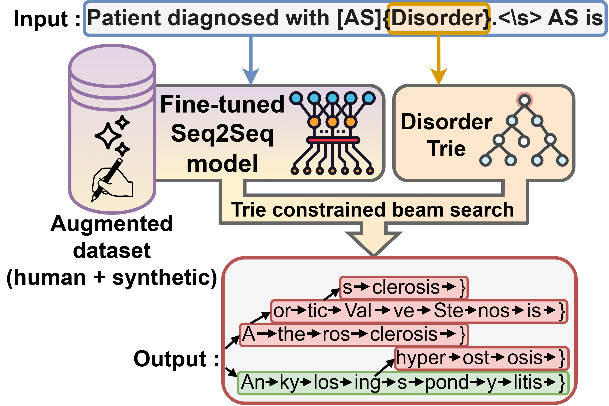

# SynCABEL: Synthetic Contextualized Augmentation for Biomedical Entity Linking

<div align="center">
    
    <p align="center">
<!-- <a href="https://doi.org/10.5281/zenodo.13838918"></a> -->
<a href="https://github.com/astral-sh/uv" target="_blank">
    
</a>
<a href="https://github.com/astral-sh/ruff" target="_blank">
    
</a>
</p>
</div>

A novel approach for biomedical entity linking using synthetic contextualized data generation to improve model performance. This repositoy contains the computer code that has been executed to generate the results of the article:
```
@unpublished{syncabel,
author = {Adam Remaki and Christel Gérardin and Xavier Tannier},
title = {SynCABEL: Synthetic Contextualized Augmentation for Biomedical Entity Linking},
note = {Manuscript submitted for publication},
year = {2025}
}
```

## Quick Start

1. **Install dependencies**:
```bash
# Install uv package manager
curl -LsSf https://astral.sh/uv/install.sh | sh

# Clone the repository
git clone https://github.com/XXXX/syncabel.git
cd syncabel

# Create virtual environment and install dependencies
uv venv --python 3.9
source .venv/bin/activate
uv sync
```

2. **Run the pipeline**:
```bash
# Step 1: Preprocess UMLS data
uv run python scripts/1_preprocess_UMLS/extract_umls_data.py
uv run python scripts/1_preprocess_UMLS/prepare_umls_MM_data.py
uv run python scripts/1_preprocess_UMLS/prepare_umls_QUAERO_data.py

# Step 2: Generate synthetic data
uv run python scripts/2_generate_synthetic_data/prepare_concepts.py
uv run python scripts/2_generate_synthetic_data/generate_synthMM.py
uv run python scripts/2_generate_synthetic_data/generate_synthQUAERO.py

# Step 3: Prepare final training data (auto-generates embeddings if missing)
uv run python scripts/3_prepare_data/run.py run

# Step 4: Train model
uv run python scripts/4_train.py

# Step 5: Run inference
uv run python scripts/5_infer.py

# Step 6-8: Evaluate results
uv run python scripts/6_evaluate_syncabel.py
uv run python scripts/7_evaluate_scispacy.py
uv run python scripts/8_evaluate_embedding.py
```

## Project Structure

```
syncabel/
├── scripts/                    # Training and evaluation pipeline
│   ├── 1_preprocess_UMLS/     # UMLS data preprocessing
│   │   ├── extract_umls_data.py
│   │   ├── prepare_umls_MM_data.py
│   │   └── prepare_umls_QUAERO_data.py
│   ├── 2_generate_synthetic_data/  # Synthetic data generation
│   │   ├── prepare_concepts.py
│   │   ├── generate_synthMM.py
│   │   └── generate_synthQUAERO.py
│   ├── 3_prepare_data.py      # Final data preparation
│   ├── 4_train.py             # Model training
│   ├── 5_infer.py             # Model inference
│   ├── 6_evaluate_syncabel.py # SynCABEL evaluation
│   ├── 7_evaluate_scispacy.py # SciSpacy baseline evaluation
│   └── 8_evaluate_embedding.py # Embedding-based evaluation
├── syncabel/                   # Main package
│   ├── utils.py                 # Helper functions
│   ├── guided_inference.py    # Guided inference logic
│   ├── models.py              # Model definitions
│   ├── parse_data.py          # Data parsing utilities
│   └── trie.py                # Trie data structure
├── data/                      # Datasets and knowledge bases
├── models/                    # Saved model checkpoints
├── pyproject.toml             # Dependencies and project config
├── uv.lock                    # Dependency lock file
└── README.md                  # Project presentation
```

## Datasets

- **MedMentions-ST21pv**: Largest english biomedical entity linking corpus
- **QUAERO**: French biomedical entity linking corpus

## License

MIT License - see [LICENSE](LICENSE) for details.

## Contributing

Issues and pull requests welcome!
